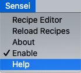

## Install Sensei

We need to install the Sensei plugin before we can do anything.

The easiest way to install it is from within **%IDE_NAME%** itself:

- From **Preferences\Settings | Plugins**:
  - On macOS: use **IntelliJ IDEA | Preferences | Plugins**
  - On Windows: use **Settings | Plugins**
- Choose **Marketplace**
- search for "**Sensei secure code warrior**"
- Click the `[Install]` button

If you need more help installing plugins then there are <a href="https://www.jetbrains.com/help/idea/managing-plugins.html">instructions on the JetBrains site</a>. 

You'll need to restart **%IDE_NAME%**, and when you do. We'll see you back here in a few seconds to start on the next task.

---

> Click `[Check]` when you are ready to move on to the next task.

---

You'll know when Sensei is installed because you'll see the Sensei menu in the menu bar.

And you'll see the "Sensei Cookbooks" tab in the bottom.

